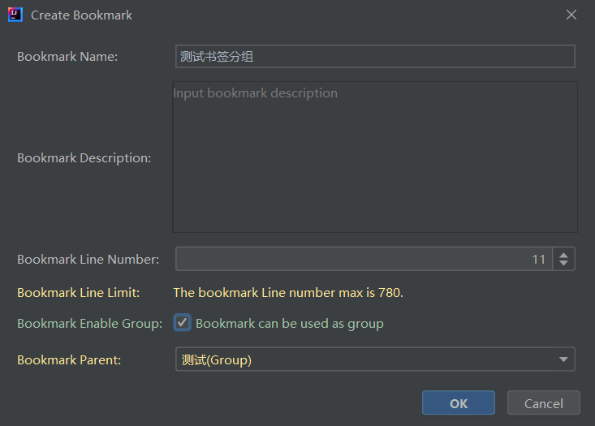
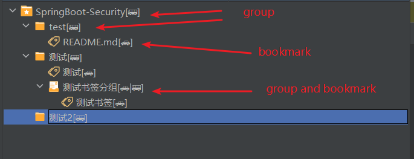
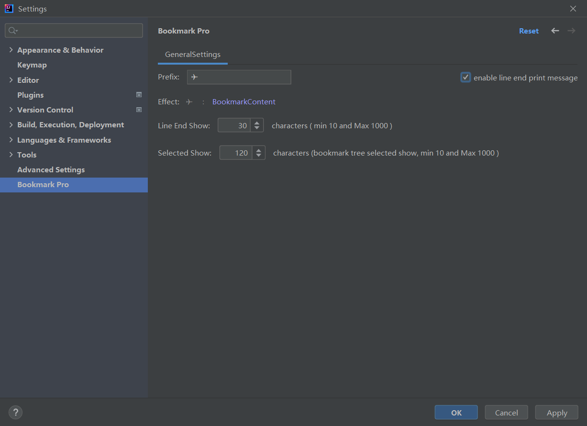
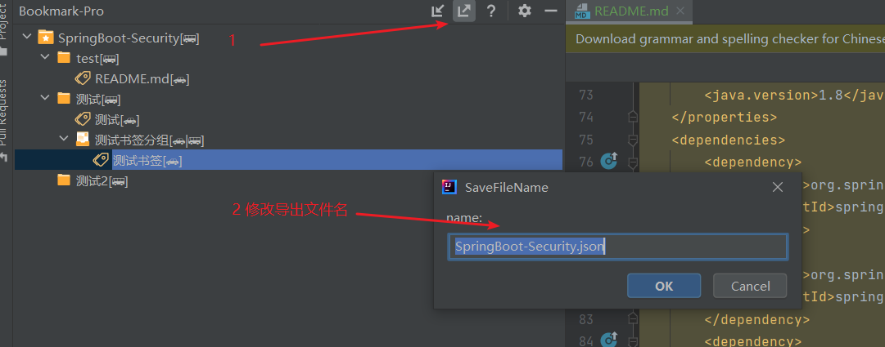

# Bookmark-Pro

一款简单易用的IDEA书签插件。可以进行书签分组、书签切换、代码跳转、书签注释展示以及配置， 使代码更容易阅读。
Bookmark-Pro借鉴[Bookmark-X](https://plugins.jetbrains.com/plugin/22013-bookmark-x)在此基础上修改并添加一些实用的功能。

# 感谢

感谢大家的付出与努力。此排序不分先后。

- [sjz128751](https://github.com/sjz128751)
- [zqc11](https://github.com/zqc11)

# 使用说明

- 添加书签
  鼠标停留至代码编辑区，使用快捷键 `Alt+shift+A` 添加书签，当没有添加任何分组时，书签默认添加在工具窗口的 根目录(名称为项目名)。
  

- 快速删除
  光标置于书签行，使用快捷键`Alt+shift+D` 可以快速删除书签。

- 添加分组
  右键书签树的任意位置，点击 `添加分组`，输入分组名称之后，如果右键位置为 分组节点，则在其子级添加分组，如果为标签节点，则在其同级目录添加分组。
  选中分组节点，将使该节点变为激活状态，后续默认将书签添加至该分组

- 书签树
  

- 书签导航
  选择分组-使用快捷键 `Alt+shift+左/右方向键` 可切换并导航至书签指向的代码位置，切换行为只会在当前激活的分组下进行，并按书签从上到下的顺序进行切换。

- 调整书签顺序
  选择并拖拽书签节点即可调整书签位置，可以此来改变书签的顺序。

- 配置展示信息
  通过简单的配置控制书签展示内容。
  

- 导出书签
  快速导出保存书签。
  

- 自动识别失效书签
  `❌ (Invalid Bookmark)`: 此书签标注行内容发生了变化，提示及时更新书签信息。
  

# 支持

# 交流 & 沟通

# 更新历史记录

[212-222.01.04/223-241.01.02]

- 优化书签树管理窗口：书签右键编辑菜单
- 书签管理添加查询功能
- 修复多项目启动书签树失效
- 增加书签定时备份
- 修复一些已知问题

# 迭代演变进度

- [X] 基础功能以及现有问题优化
- [ ] 支持GIT分支切换
- [ ] 支持多人协作修改